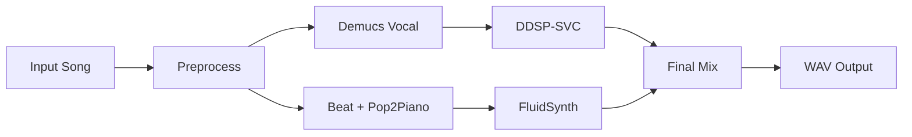

# PIANO

## Character-Aware AI Vocal Cover Pipeline with Generated Piano Accompaniment

**Input** — one song &emsp; **Output** — vocal + piano mix &emsp; **Speedup** — 3.5–13.1x

Chunyu Liu · Kairui Li · Beier Li

<!--
Opening, 30 seconds. The goal is straightforward: given one input song, generate a cover with the target character's vocal timbre, add generated piano accompaniment, and return a mix that users can listen to and download.
-->

---
layout: two-cols
layoutClass: gap-12
---

# Why This Project?

AI cover is not just "changing the voice". To produce a listenable result, the system must solve several tasks at the same time:

- Separate vocals from a full mix
- Preserve melody, rhythm, and pronunciation content
- Convert the vocal into a target character or singer timbre
- Generate piano accompaniment that fits the original song
- Let users control, preview, download, and remix the result

::right::

### From isolated models to a usable music application

Our main work is not training a new end-to-end model. It is turning multiple mature music models into a reproducible, interactive, and optimizable system.

<!--
About 40 seconds. Emphasize that the complexity comes from system integration: source separation, SVC, Pop2Piano, rendering, mixing, and user interaction all need to work together.
-->

---

# End-to-End Architecture

FastAPI backend manages uploads, jobs, SSE progress events, artifacts, cancellation, remixing, and model readiness.

<!--
About 45 seconds. Walk through the figure: the frontend selects roles and parameters, the backend queues the job, the worker runs the pipeline, intermediate artifacts are saved, and progress is pushed through SSE before download or remix.
-->

---
class: flex flex-col
---

# Model Pipeline

<!--
About 40 seconds. Make the two branches clear: the vocal branch handles separation and timbre conversion, while the piano branch handles beat estimation, piano MIDI generation, and rendering. They meet only at the final mixing stage.
-->

---
layout: two-cols
layoutClass: gap-12
---

# User Controls

- Role selection from backend config
- Pitch shift: −12 to +12 semitones
- Vocal and piano volume: 0.0 to 2.0
- Server-sent progress events
- Playback, artifact download, cancellation
- Remix endpoint without rerunning models

::right::

### Eight DDSP-SVC roles pre-trained & configured

Supports Tomorin, Anon, Soyo, Taki, Oblivionis, Mortis, Amoris, Doloris.

<!--
About 35 seconds. Emphasize that we trained or configured eight DDSP-SVC role checkpoints, and the frontend is not a static page: it reads backend config, supports progress updates, and allows remixing.
-->

---

# Initial Bottleneck

- **Cold start** — Repeated model loading, CUDA initialization, and first-run kernel overhead.
- **Small GPU work** — DDSP segments launched one by one, with repeated invariant projections.
- **Sequential idle time** — Vocal and piano branches waited for each other unnecessarily.

**Optimization goal:** make inference warm, parallel, batched, and observable.

<!--
About 35 seconds. Move to the pre-optimization problem. We first used timings.json to build a baseline, then optimized around three latency sources: fixed overhead, repeated computation, and sequential waiting.
-->

---

# Runtime Optimization Overview

<!--
About 45 seconds. Explain the core changes in the figure: preload and warmup move fixed cost to startup; torchaudio and Beat-This move suitable work onto CUDA; the two branches run in parallel; final mixing is the synchronization point.
-->

---

# Key Engineering Changes

<v-clicks>

- **Instrumentation** — Stage and sub-stage timings written to `timings.json`.
- **Preload + warmup** — Demucs, DDSP roles, RMVPE, Beat-This, Pop2Piano loaded on CUDA before any job.
- **Conditioner cache** — DDSP Reflow projection computed once per segment instead of every ODE step.
- **DDSP batching** — Length-sorted segment batches reduce kernel-launch and transfer overhead.
- **Branch parallelism** — Vocal and piano branches run with `ThreadPoolExecutor` and separate CUDA streams.
- **Frontend pre-upload** — File transfer overlaps with user parameter selection.

</v-clicks>

<!--
About 50 seconds. Do not explain code line by line. Instead, connect each optimization to the bottleneck it addresses. Observability is the foundation, and each later optimization is validated with timings.
-->

---

# Result: End-to-End Speedup

| 30s clip | 120s clip | 330s clip |
|----------|-----------|-----------|
| **13.1×** | **6.2×** | **3.5×** |

<!--
About 40 seconds. Short clips get the largest speedup because model loading, process startup, and orchestration overhead are a larger share of total runtime. For longer clips, model inference dominates more, so the relative speedup drops but still remains 3.5×.
-->

---
layout: two-cols
layoutClass: gap-8
---

# Evaluation Scope

### Measured

- End-to-end runtime
- Demucs / DDSP / Pop2Piano / render / mix timings
- Sequential vs parallel branches
- Preload and warmup impact

::right::

### Qualitative

- Voice timbre and intelligibility
- Pitch and timing preservation
- Piano density and rhythm alignment
- Final vocal-piano balance

> We avoid unsupported numerical audio-quality scores; quality is presented through sample-based listening cases.

<!--
About 35 seconds. Explain the evaluation boundary: runtime is quantified, but audio quality does not have a formal listening study, so we present case studies instead of inventing MOS or accuracy numbers.
-->

---

# What We Built

- **Complete inference pipeline** — Input song to converted vocal, generated piano, and final WAV.
- **Configurable roles** — Eight DDSP-SVC role checkpoints with per-role runtime metadata.
- **Production-style backend** — Uploads, jobs, SSE progress, cancellation, artifacts, remixing.
- **Optimized runtime** — Preloaded, warmed, CUDA-accelerated, batched, and parallelized.

> **Takeaway:** separate pretrained music models become useful only after system-level integration and inference optimization.

<!--
Closing, 35 seconds. Return to the contribution: this is not a single model, but a usable system, and engineering optimization moves the waiting time from minutes toward the target of tens of seconds.
-->

---
layout: end
---

# Thank You

Questions?

