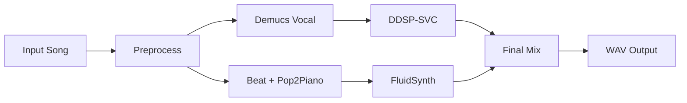

# PIANO

## Character-Aware AI Vocal Cover Pipeline with Generated Piano Accompaniment

**Input** — one song &emsp; **Output** — vocal + piano mix &emsp; **Speedup** — 3.5–13.1x

Chunyu Liu · Kairui Li · Beier Li

<!--
大家好，我们做的项目叫做 PIANO。PIANO 是一个端到端的 AI 翻唱系统，可以把人声转换成目标角色的音色，同时生成钢琴伴奏。输入一首歌，输出一个混音结果，可以直接听和下载。我们对系统进行了推理优化，整体加速了 3.5 到 13.1 倍。
-->

---
layout: two-cols
layoutClass: gap-12
---

# Why This Project?

AI cover is not just "changing the voice". To produce a listenable result, the system must solve several tasks at the same time:

- Separate vocals from a full mix
- Preserve melody, rhythm, and pronunciation content
- Convert the vocal into a target character or singer timbre
- Generate piano accompaniment that fits the original song
- Let users control, preview, download, and remix the result

::right::

### From isolated models to a usable music application

Our main work is not training a new end-to-end model. It is turning multiple mature music models into a reproducible, interactive, and optimizable system.

<!--
为了做出能听的结果，我们在流水线中加入了这些stage：
1. 把原曲的人声分离出来
2. 保留旋律和发音
3. 把人声转成目标角色的音色
4. 生成匹配原曲的钢琴伴奏
5. 混音钢琴伴奏和人声

能调参数、试听、下载、重混。
-->

---

# End-to-End Architecture

FastAPI backend manages uploads, jobs, SSE progress events, artifacts, cancellation, remixing, and model readiness.

<!--
这是整体架构。前端选择角色、调参数，后端把任务排进队列，worker 按流水线一步步跑。每一步的中间结果都存下来，进度通过 SSE 实时推到前端。跑完之后下载成品，也可以换个参数重新混音。
-->

---
class: flex flex-col
---

# Model Pipeline

<!--
模型pipeline分两条线。一边是人声：Demucs 分离，DDSP-SVC 转音色。一边是钢琴：抓节拍，Pop2Piano 生成 MIDI，FluidSynth 合成。两条线并行执行，最后在混音阶段汇合。
-->

---
layout: two-cols
layoutClass: gap-12
---

# Model Training & Data

- Most components use pretrained releases: Demucs, RMVPE, ContentVec, HiFi-GAN, Pop2Piano, and Beat-This.
- Project-specific training focuses on the eight DDSP-SVC character voice checkpoints.
- Voice data was manually collected, cleaned, sliced, and prepared as DDSP-SVC training material.
- Main sources: MyGO!!!!! game voice compilations, Nyamu dry vocals, and Uika / Ave Mujica anime voice clips.

::right::

### Eight DDSP-SVC roles trained & configured

<!-- Supports Tomorin, Anon, Soyo, Taki, Oblivionis, Mortis, Amoris, Doloris. -->

  
  
  
  
  
  
  
  

<!--
系统里大多数模型没有重新训练，而是直接使用公开的预训练模块，比如 Demucs、RMVPE、ContentVec、HiFi-GAN、Pop2Piano 和 Beat-This。我们自己项目主要集中在 8 个 DDSP-SVC 角色音色模型上。训练数据来自角色语音素材。
-->

---

# Initial Bottleneck

- **Cold start** — Repeated model loading, CUDA initialization, and first-run kernel overhead.
- **Small GPU work** — DDSP segments launched one by one, with repeated invariant projections.
- **Sequential idle time** — Vocal and piano branches waited for each other unnecessarily.
- **CPU rhythm extraction** — Essentia beat tracking blocked the piano branch from using CUDA acceleration.

**Optimization goal:** make inference warm, parallel, batched, and observable.

<!--
优化之前有三个瓶颈。

1. 冷启动，每次都要重新加载模型、初始化 CUDA。
2. 小任务反复调 GPU，DDSP 一段一段跑，同一份 projection 算了无数遍。
3. 人声和钢琴两条线串行等，资源空转。
4. 钢琴分支里的节拍提取原来用 Essentia，基本是 CPU-bound。我们把它换成 Beat-This，让节拍检测可以走 GPU，并复用 File2Beats tracker，避免每次重新初始化。
-->

---

# Runtime Optimization Overview

<!--
优化的核心思路。预加载和warmup把模型的固定开销挪到一开始，用户发请求时模型已经在 GPU 上、已经跑过一遍了。然后能搬上 CUDA 的计算尽量搬。然后人声和钢琴并行执行，在混音前同步。
-->

---

# Key Engineering Changes

- **Instrumentation** — Stage and sub-stage timings written to `timings.json`.
- **Preload + warmup** — Demucs, DDSP roles, RMVPE, Beat-This, Pop2Piano loaded on CUDA before any job.
- **Conditioner cache** — DDSP Reflow projection computed once per segment instead of every ODE step.
- **DDSP batching** — Length-sorted segment batches reduce kernel-launch and transfer overhead.
- **Branch parallelism** — Vocal and piano branches run with `ThreadPoolExecutor` and separate CUDA streams.
- **Frontend pre-upload** — File transfer overlaps with user parameter selection.

<!--
具体做了六项工程改动

1. 首先加入 timing report 方便后续优化
2. 预热把模型提前跑一遍
3. DDSP Reflow 条件缓存省掉重复计算
4. 把长音频切成短的片段，DDSP 打 batch 减少 GPU 调度开销
5. 分支并行，用两个 CUDA Stream 让人声钢琴同时跑
6. 前端预上传让传文件和选参数重叠
-->

---

# Result: End-to-End Speedup

| 30s clip | 120s clip | 330s clip |
|:--------:|:---------:|:---------:|
| **13.1×** | **6.2×** | **3.5×** |

<!--
优化结果。30 秒片段 13.1 倍加速，120 秒 6.2 倍，330 秒 3.5 倍。短片段加速最明显，因为固定开销被摊掉了；长片段模型推理占比大，但也有三倍多的提升。
-->

---
layout: two-cols
layoutClass: gap-8
---

# Evaluation Scope

### Measured

- End-to-end runtime
- Demucs / DDSP / Pop2Piano / render / mix timings
- Sequential vs parallel branches
- Preload and warmup impact

::right::

### Qualitative

- Voice timbre and intelligibility
- Pitch and timing preservation
- Piano density and rhythm alignment
- Final vocal-piano balance

> We avoid unsupported numerical audio-quality scores; quality is presented through sample-based listening cases.

<!--
评估分两块。左边是量化指标：端到端耗时、各模型阶段耗时、串行和并行对比、预热前后对比。右边是定性评估：音色像不像、音准稳不稳、钢琴密度合不合理、人声和钢琴比例。没做正式听感实验，用实际样例来展示效果。
-->

---

# What We Built

- **Complete inference pipeline** — Input song to converted vocal, generated piano, and final WAV.
- **Configurable roles** — Eight DDSP-SVC role checkpoints with per-role runtime metadata.
- **Production-style backend** — Uploads, jobs, SSE progress, cancellation, artifacts, remixing.
- **Optimized runtime** — Preloaded, warmed, CUDA-accelerated, batched, and parallelized.

> **Takeaway:** separate pretrained music models become useful only after system-level integration and inference optimization.

<!--
最后总结。我们做了一套完整的推理流水线，配了 8 个角色模型，搭了一个生产级的后端，然后通过工程优化把推理加速了 3.5 到 13 倍。结论很简单：不仅需要预训练模型，而且要做好系统集成和推理优化，才能真正跑起来给人用。
-->

---
layout: end
---

# Thank You

Questions?

<a href="https://github.com/Haru-LCY/DeepLearning-Project" target="_blank" class="mt-8 inline-flex items-center gap-3 text-xl opacity-80 hover:opacity-100">
  <carbon-logo-github class="text-2xl" />
  github.com/Haru-LCY/DeepLearning-Project
</a>

<!--
谢谢！
-->
